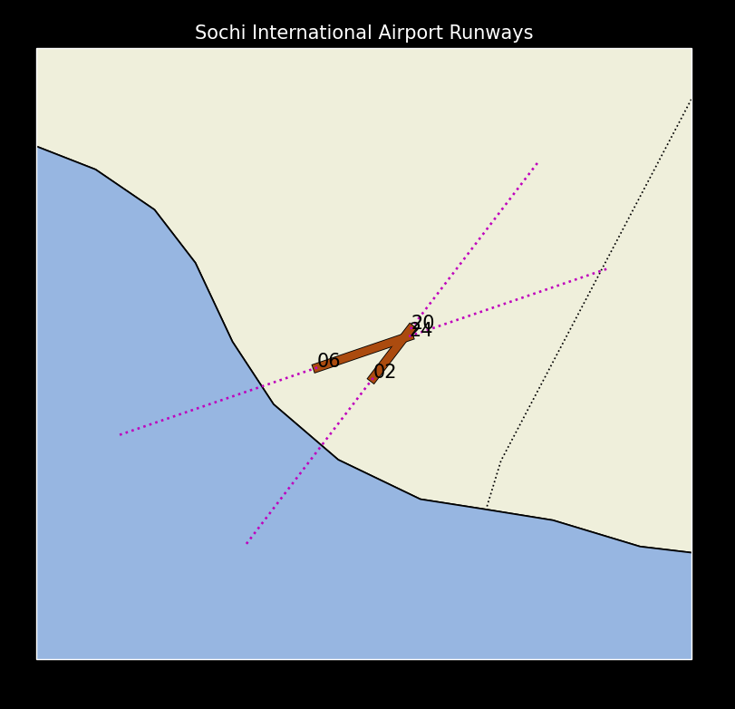
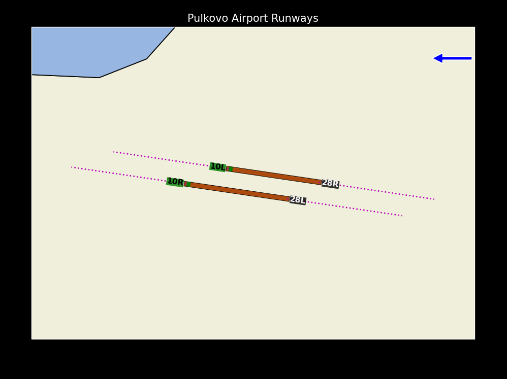
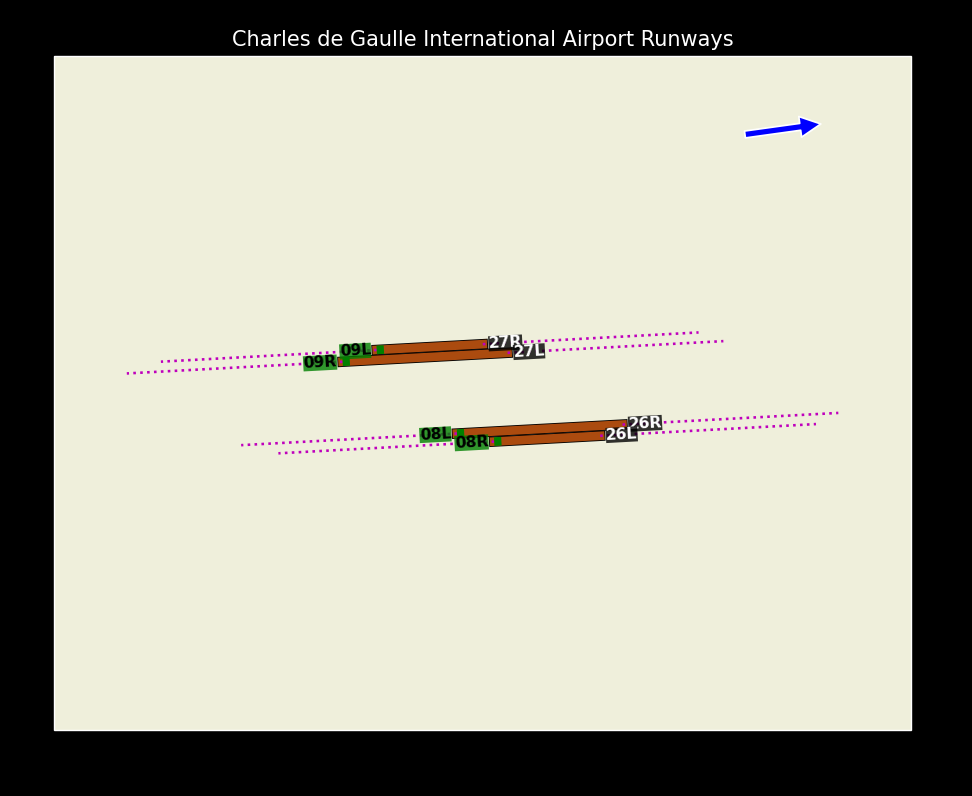

## images

  

## ENG - Description of Files

```
┌── runway_data.py      # Get data about the runway(s)
├── weather_data.py     # Get weather information at the airport
├── plot.py             # Draws runway(s) and other data.
└── main.py             # The file through which we launch the program
```

## Do You See This Code?

This code is in closed access. If you can see it, it means you have access to it. If you plan to use this code for your purposes, I kindly ask you to notify the author.

## Note
If you have any suggestions to improve the code, please contact @xAvakov via Telegram.
> The open version of the project is available [here](https://github.com/onesch/Airport-Runways-in-Map-public).

## License

This project is licensed under the MIT License. See the [LICENSE](LICENSE) file for details.

#

## RUS - Описание файлов

```
┌── runway_data.py      # Получаем данные о взлетно-посадочной полосе
├── weather_data.py     # Получаем информацию о погоде в аэропорту
├── plot.py             # Рисует ВПП и другие данные.
└── main.py             # Файл, через который запускаем программу
```

## Ты видишь этот код?

Этот код находится в закрытом доступе, если ты видишь его, значит, ты имеешь доступ к нему, если ты планируешь использовать этот код для своих целей, я прошу тебя уведомить об этом автора.

## Примечание
Если у вас есть какие-либо предложения улучшить код, обратитесь к @xAvakov через Telegram.
> Открытая версия проекта [здесь](https://github.com/onesch/Airport-Runways-in-Map-public).

## Лицензия

Этот проект лицензирован под MIT License. Подробности см. в файле [LICENSE](LICENSE).
