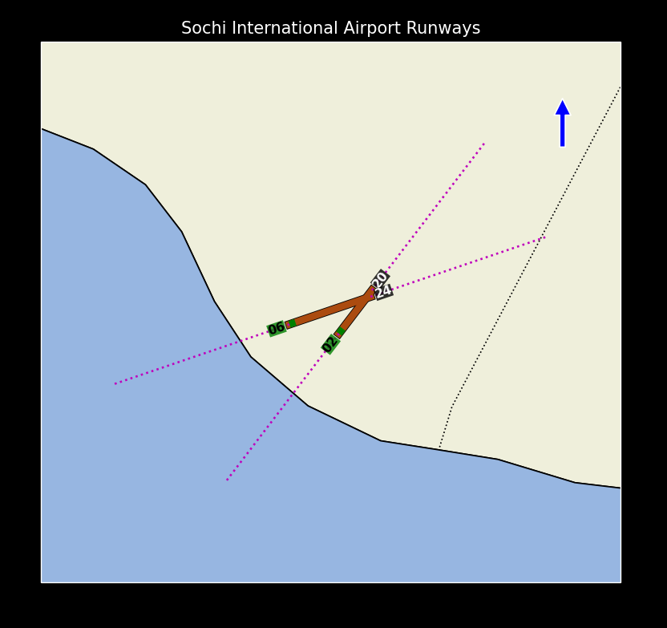

## images

  

## ENG - How to View the Code?

For more information, contact via [Telegram](https://t.me/xAvakov).

## Note

If you have any suggestions to improve the code, please contact via Telegram](https://t.me/xAvakov).

Description of the files and the files themselves are only in a private copy

The closed project uses the `MIT` license.

#

## RUS - Как посмотреть код?

Для дополнительной информации свяжитесь через [Telegram](https://t.me/xAvakov).

## Примечание

Если у вас есть какие-либо предложения улучшить код, свяжитесь через [Telegram](https://t.me/xAvakov).

Описание файлов и сами файлы только в закрытой копии

Закртый проект использует лицензию `MIT`
